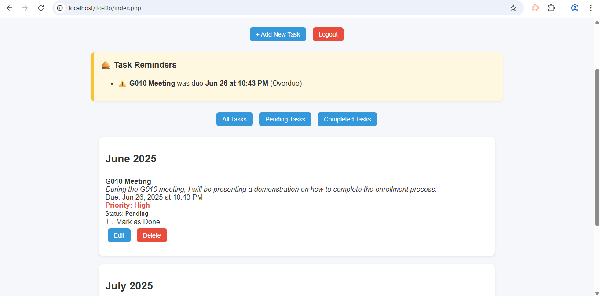
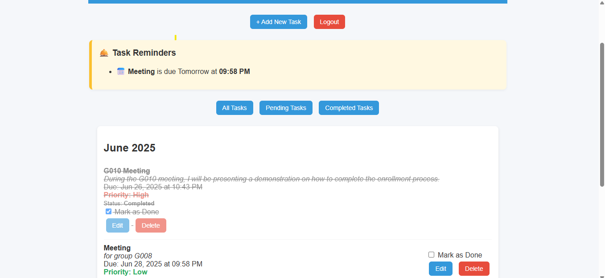

# 🧠 ProTasker – Smart Task & Productivity Dashboard

**ProTasker** is a powerful yet simple task management web app built with PHP, MySQL, and JavaScript. It helps users organize their tasks, subtasks, and priorities in a responsive dashboard with calendar integration and real-time reminders.

---

## 🚀 Features

✅ User Login & Session Management  
✅ Add, Edit, and Delete Tasks  
✅ Priority Levels (High / Medium / Low)  
✅ Filter by All / Pending / Completed Tasks  
✅ Smart Reminder Alerts for Today, Tomorrow, and Overdue  
✅ Subtask Management (AJAX-based)  
✅ Interactive Calendar (FullCalendar.js)  
✅ Mobile-Responsive Design  
✅ Dark Mode Toggle  

---

## 🖼️ Screenshots

| Dashboard with Tasks | Mark as Done View | 
|----------------------|---------------|
|  |  | 

---

## ⚙️ Tech Stack

- **Frontend:** HTML, CSS, JavaScript, FullCalendar.js  
- **Backend:** PHP (Procedural), MySQL  
- **Security:** Input sanitization, Session-based authentication  
- **Extras:** Responsive UI, Dark Mode, AJAX for subtasks

---

